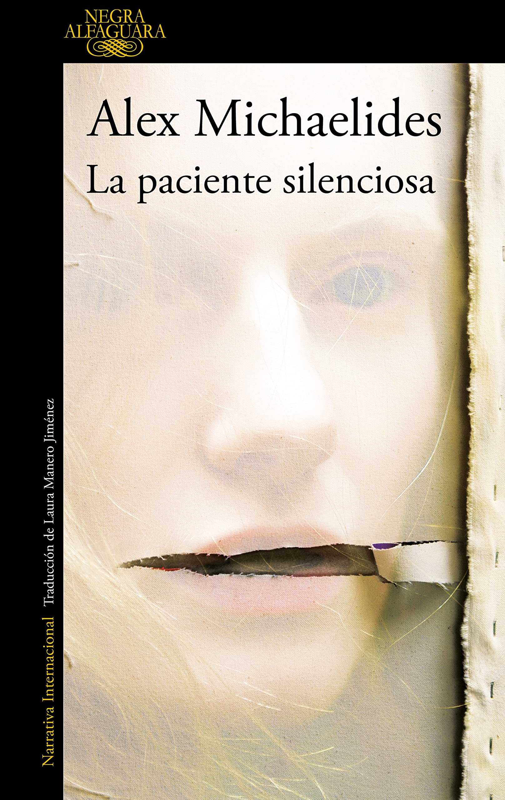

<!-- 

  ⚠️
  <strong>Advertencia de spoilers:</strong> Este blog puede revelar detalles importantes de la trama. Lee bajo tu propia responsabilidad.

 -->

  

  

  

# Sinopsis

Alicia Berenson, una pintora de éxito, descarga cinco tiros a la cabeza de su marido, y no vuelve a hablar nunca más. Su negativa a pronunciar palabra alguna convierte una tragedia doméstica en un misterio que atrapa la imaginación de toda Inglaterra.

Theo Faber, un ambicioso psicoterapeuta forense obsesionado con el caso, está empeñado en desentrañar el misterio de lo que ocurrió aquella noche fatal y consigue una plaza en The Grove, la unidad de seguridad del norte de Londres a la que Alicia fue enviada seis años atrás y en la que sigue obstinada en su silencio.

Pronto descubre que el mutismo de la paciente está mucho más enraizado de lo que creía. Pero, si al final ella hablara, ¿estaría dispuesto a escuchar la verdad?

  

## Historia

<!-- 

  ✅
  <strong>Sin spoilers:</strong> Esta sección aún no revela detalles importantes de la trama.

 -->

### Narracion

La historia de "La Paciente Silenciosa" es contada desde dos puntos de vista. Por un lado, esta siendo narrada por Theo, un psicoterapeuta que esta obsecionado con el caso de Alicia, y obtiene la oportunidad de trabajar en la unidad donde vive Alicia. Por otro lado, tambien tenemos el punto de vista de Alicia, que es contado mediante su diario, un regalo de Gabriel, su marido. El diario plasma todos los pensamientos de Alicia antes del crimen.
La perspectiva de Theo y Alicia se intercalan a lo largo de la novela, haciendo que poco a poco las piezas se vayan uniendo en la mente del lector.

Cada capítulo explica la persectiva de Theo o de Alicia, mas nunca ambos en el mismo capitulo, aislando ambas historias hasta el final.

<!-- 

  ⚠️
  <strong>Spoilers a partir de aquí:</strong> Las siguientes secciones revelan detalles importantes de la trama.

 -->

## Trama

### Informacion General

La historia de Theo es contada en primera persona, de modo que el nos narra su perspectiva de los hechos, nos cuenta los detalles de su infancia como estos lo llevaron a interesarse en la psicologia, nos cuenta su historia con Ruth, su antigua psicologa, y como ella ayudo a que tuviera su interes en la psicologia.

Tambien leemos el inicio de la historia de Alicia, que es contada en su diaro, dias antes del crimen. Ella narra como Gabriel le dio ese diario, y como ella se siente feliz con su matrimonio, aunque a veces se siente un poco sola.

A medida que avanza la historia, descubrimos secretos del pasado de Alicia, como de Theo, lo que nos lleva a entender mejor las motivaciones de ambos personajes.

Y vemos como las personas "cercanas" a Alicia, como su mejor amigo, el hermano de su marido, y su propio marido, tienen sus propios secretos y motivaciones que afectan la historia.

## Mi opinion

La paciente silenciosa es un libro corto, y sencillo de leer, pero con una trama enganchante que te mantiene pegado hasta el final. El plot twist me obligo a leer el libro una segunda vez para comprender completamente la historia.
Aun asi debo decir que el plot twist me parecio antinatural hasta cierto punto, aun asi eso no impidio que me gustara el libro, y que disfrutara de haberlo leido.

Es una novela que recomendaria para cualquier persona que le guste el thriller y quiera disfrutar de una historia corta pero muy llamativa.
